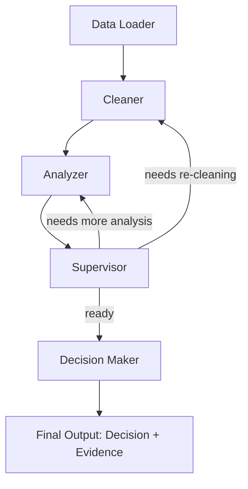

# AI Multi-Agent System (LangGraph) — CSV Analysis Notebook

A learning project exploring multi-agent system (MAS) design patterns using **LangGraph**. The goal is to internalize core MAS concepts (node orchestration, state passing, supervision, tool loops) before moving on to a production-grade implementation.

## What It Does

Given a raw CSV file, the system:
1. Loads the data into a pandas DataFrame
2. Writes and executes code to clean and understand the data
3. Analyzes the cleaned data and extracts insights
4. Produces a **suggested decision**, backed by **evidence** from the analysis

## Architecture

The system is built as a LangGraph graph with the following nodes:

| # | Node | Responsibility |
|---|------|-----------------|
| 0 | **Data Loader** | Reads the CSV and converts it into a DataFrame |
| 1 | **Cleaner** | Writes/executes cleaning code (nulls, types, duplicates, outliers) |
| 2 | **Analyzer** | Explores the cleaned data, generates statistics/insights |
| 3 | **Supervisor** | Coordinates the flow between nodes, decides next step |
| 4 | **Decision Maker** | Synthesizes insights into a final recommendation + evidence |

## Known Issues

- **Performance**: the system currently runs slowly and hits the LLM's rate limit.
- **Root cause (suspected)**: too many tool-calling loops, and a supervisor node that re-routes too aggressively / too often.

## Planned Fixes

- [ ] Reduce the number of tool-call iterations per node (cap retries, add early-exit conditions)
- [ ] Redesign the Supervisor node's routing logic — fewer, more decisive routing decisions instead of frequent back-and-forth
- [ ] Add caching/memoization for repeated tool calls on the same DataFrame state
- [ ] Consider batching LLM calls where possible instead of one call per micro-step

## Tech Stack

- **LangGraph** — agent orchestration
- **pandas** — data manipulation
- **LLM (via API)** — code generation, analysis, and decision synthesis

## Status

🚧 Work in progress — first iteration focused on learning MAS fundamentals before building a production version.

## Next Steps

Once the rate-limit/slowness issue is resolved, the plan is to apply the same concepts to a production-level MAS architecture.
